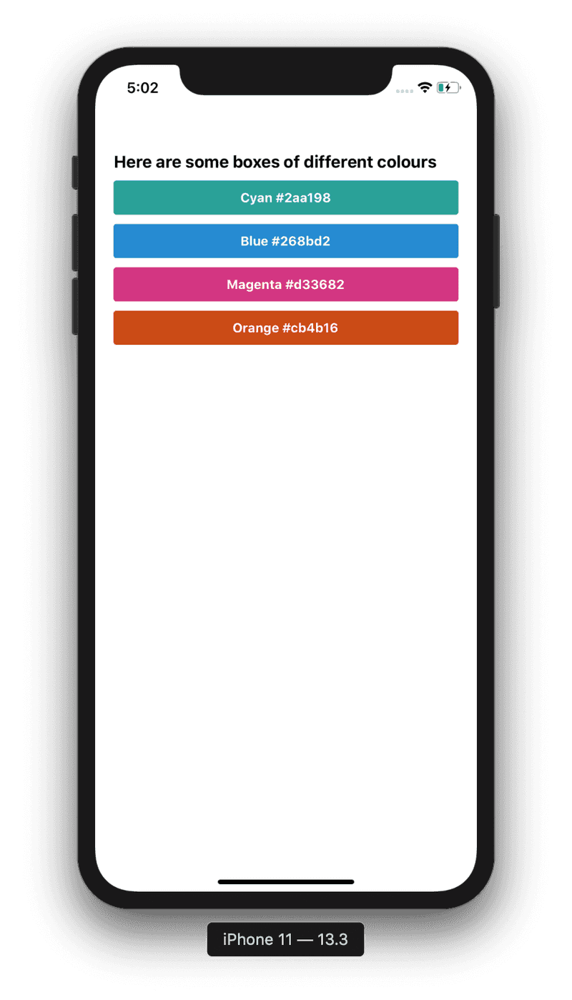

# Coolers

In this exercise, we will create a color palette that showcases your favourite colors. You should have a similar output to this one 

## Steps:

- [ ] Go to [coolers.co](https://coolors.co/) and generate a random color palette

- [ ] Create the boxes with `View`

- [ ] Use `StyleSheet` to style your boxes and texts with the margins and paddings needed
